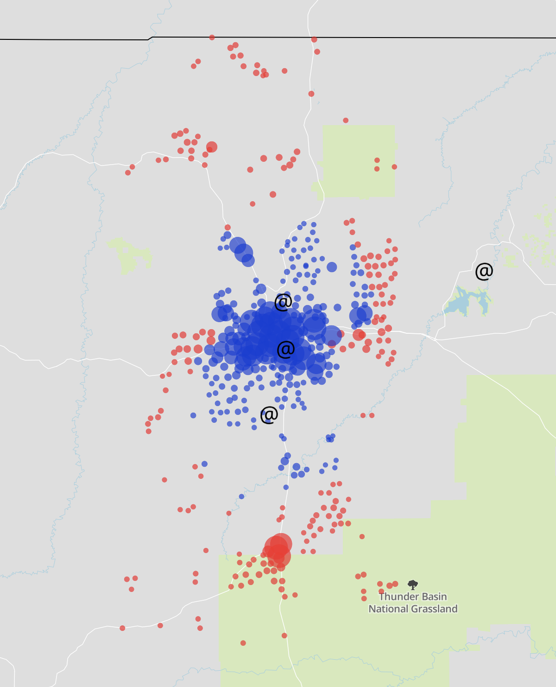
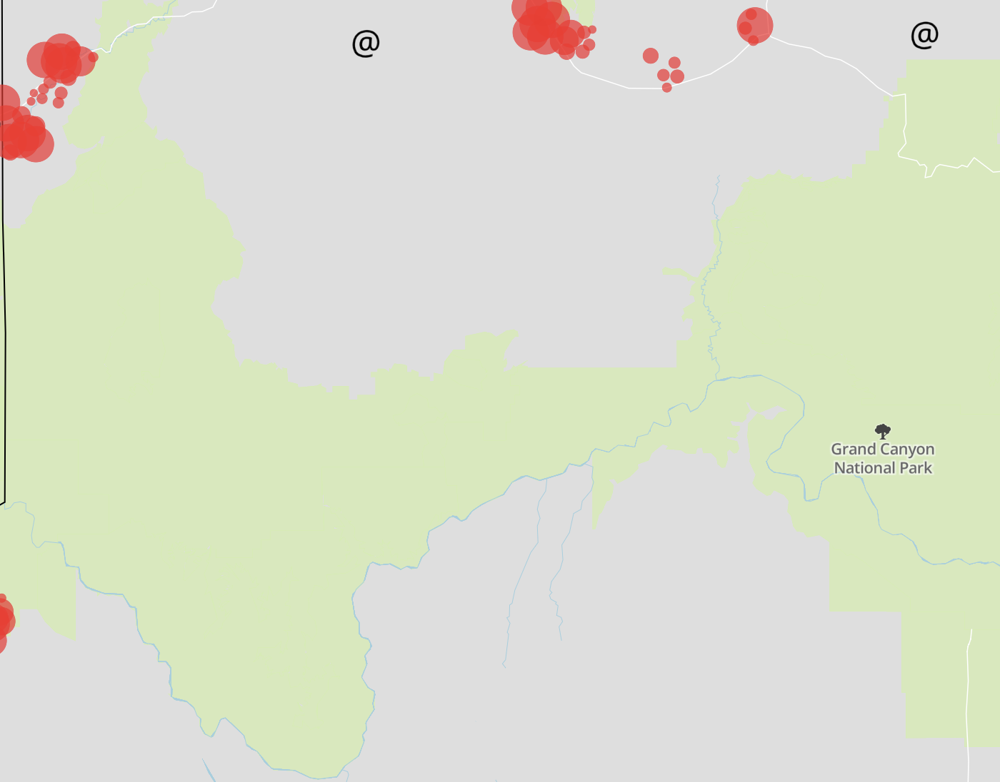
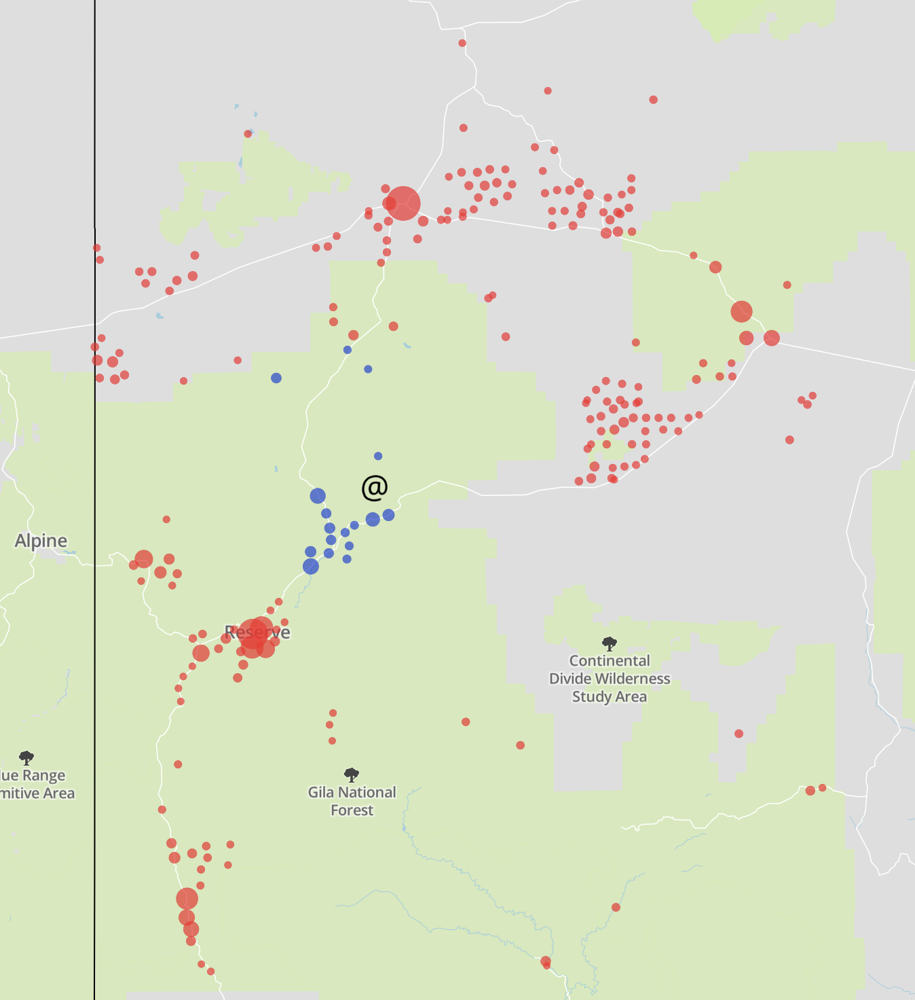

## Geographic Population Distribution Datasets

## Background and Overview

In order to best provide the public with TODO

For instance, the Health Resources and Services Administration (HSRA) designates certain geographic regions as [shortage areas](https://datawarehouse.hrsa.gov/topics/shortageAreas.aspx) in order to allocate federal funding to support critical healthcare services in these areas[0](#footnote-hpsas).

Earlier in 2018, Beacon Labs launched [Encompass](https://encompass.thebeaconlabs.org/), an initiative to measure access between people and providers of critical social services like hospitals and primary care providers. When building this tool, we examined different sources of population information to determine where people live and work. Our goal was to provide transparent, easily-reproducible, and precise analyses of geographic access. With that goal in mind, four guiding principles in our decision among data sources were accessibility, ease-of-use, validity, and granularity:

* **Accessibility**: Is the data open-source and publicly accessible? Is the cost to acquire / license the data prohibitively expensive?
* **Ease-of-use**: Is the data thoroughly and credibly researched and curated? Up-to-date? Is it structured and cleaned in a way that's easy to work with? Are there existing frameworks / tools / methodologies for understanding the data and incorporating it with other datasets / applications?
* **Validity**: Is the data representation of population true-to-life?
* **Granularity**: What is the highest level of detail that the data offers?

Below, we discuss different sources of population distribution data and rate each one according to these four metrics.

### ZIP Codes and Mailing Routes

The United States Potal Service (USPS) is a natural place to look for this information. Mailing addresses are a decent proxy for where people live and work[1](#footnote-mailing-addresses). In particular, ZIP (Zone Improvement Plan) codes are an attractive option for determinining population density since they're a part of the everyday lives of American citizens. On the other hand, ZIP codes were designed to make mail delivery more efficient and *not* to form a geographic subdivision of the nation for the purposes of demography. This fact results in several unfortunate consequences when ZIP code data is used this way[2](#footnote-zip-code-annoyances). In addition, ZIP codes are also updated quarterly, causing headaches for longitudinal research studies.

Legislation like the [Knox-Keene Act](https://www.dmhc.ca.gov/aboutthedmhc/lawsregulations.aspx#knoxkeene) in California enshrine ZIP codes as a fundamental unit of regulation, making their continued usage for representing population unavoidable.

* **Accessibility**: Very low. The steep cost of obtaining actual route data and the restrictive terms of use pose serious challenges for using official USPS ZIP code data. Third-party sources for this data are common but lack transparent, reproducible methodologies[1](#footnote-third-party-vendors).
* **Ease-of-use**: Low. The frequent updates and additions mean that the data becomes out-of-date quickly. ZIP codes can span multiple administrative subdivisions (e.g., counties or even states), increasing the difficulty of integrating this information with other data sources.
* **Validity**: Low, since the intended purpose of this data is to track mailing addresses, not where people live. In rural areas without mailing routes, this problem is crippling.
* **Granularity**: Medium to high. There are roughly 42,000 ZIP codes in the United States (compared to 74,000 census tracts), so choosing a single point per ZIP code is not particularly granular. On the other hand, route-level data with many points per ZIP code (as used in the [Every Door Direct Mail Tool](https://eddm.usps.com/eddm/customer/routeSearch.action)) has the potential to be very granular.

### Census Divisions

In contrast, the Census Bureau is explicitly tasked with counting the number of residents across several geographic subdivisions of the country. The Bureau releases [population-weighted centroids](https://www.census.gov/geo/reference/centersofpop.html) for census tracts and block groups. Maybe these geographic units can provide a passably-faithful representation of population distribution?

In urban areas, these divisions do an excellent job of representing population distribution and density, but their fidelity in rural areas is much less consistent. Consider the case of Catron County, New Mexico, where 87% of the population lives 15 miles away from their census tract centroid:

<!-- 

 -->

Note that 30 minutes is a commonly-used threshold for access to critical healthcare services, meaning that inaccuracies of 15 minutes in either direction. This systemic blind spot poses serious problems for the determination of medically-underserved areas and the allocation of public resources to mitigate problems caused by poor geographic access, since it means that methods that use census centroids tend to over-estimate access in the very places where it is worst[3](#footnote-centroids-near-roads).

The problem is most pronounced in the less densely populated states of the Mountain West[3](#footnote-alaska), but also affects large, rural counties nationwide.

* **Accessibility**: Very high. The Census Bureau makes demographic data accessible through the [American Fact Finder](https://factfinder.census.gov/faces/nav/jsf/pages/index.xhtml). See also the [TIGER Shapefiles](https://www.census.gov/geo/maps-data/data/tiger-line.html) for census boundaries.
* **Ease-of-use**: Very high. Census data informs many existing applications and is a common source for demographic information across many fields of research.
* **Validity**: High by definition, as census data forms the standard against which other population data is compared. Note the potential problems in rural regions mentioned above.
* **Granularity**: High in densely populated areas, low in sparsely populated areas. In cases where several small, disparate communities are merged into a single census divison, census datastets have no way to distinguish among them.

### Satellite Data

Recent advances in satellite and machine learning technology have made it possible to detect buildings through satellite imagery and assign population totals to each rectangular pixel with the aid of census information. Two such datasets are the [High-Resolution Settlement Layer](http://ciesin.columbia.edu/data/hrsl/) and the [Global Human Settlement Layer](http://ghsl.jrc.ec.europa.eu/ghs_pop.php)[3](#footnote-gridded-population-of-the-world).

These datasets have the potential to provide very granular information about population distribution. Accuracy is a potential concern, as models trained on particular classes of land cover might not be easily transferrable to other regions' terrains. For many use cases, these datasets are *too* granular: the satellite images themselves are very large files, making even simple calculations computationally intractable.

Down-sampling the data can help combat this downside, resulting in more reasonable numbers of representative points for use in computation-heavy workflows (e.g., driving-time or routing calculations). This is the methdology we ultimately used in Encompass, where we wanted to display access across the country at a very high level of detail.

* **Accessibility**: High. As mentioned above, multiple datasets are available under open licenses.
* **Ease-of-use**: Varies. These datasets depend on newer technology, meaning that the research and user communities are still young. If used, the additional compute-heavy post-processing step of re-sampling the data to a lower resolution could make adoption more difficult.
* **Validity**: Not well understood. Many sources normalize population totals within census units, ensuring validity in the aggregate, but the accuracy of the population numbers for individual pixels is less certain.
* **Granularity**: Extremely high. Openly available datasets have resolutions of 100, 250, 1000 meters per pixel.

## Conclusions

It might not pose a problem for certain use cases, especially when data is being aggregated at the county or state levels.

## Footnotes

<a name="footnote-hpsas">0</a>: Two such designations are Health Professional Shortage Areas (HPSAs) and Medically Underserved Areas (MUAs). Separate HPSA designations exist for primary care, mental health, and dental health services.

<a name="footnote-mailing-addresses">1</a>: Note that mailing addresses can fail spectacularly for this purpose in places without well-defined mailing routes—for instance, in rural locations where residents pick up their mail from a single post office that isn't close to their place of residence.

<a name="footnote-zip-code-annoyances">2</a>: For example, [ZIP codes are mailing routes, not polygons](https://gis.stackexchange.com/a/2693/118314), putting the concept of a "ZIP code centroid" on shaky footing. Moreover, the routes themselves are not publicly available: the USPS sells [a variety](https://postalpro.usps.com/address-quality/delivery-statistics-product) of [products](https://postalpro.usps.com/address-quality/carrier-route-product) from which route information could be derived, but their price is a major barrier to adoption.

<a name="#footnote-third-party-vendors">3</a>: One specific third-party solution provides users with 100 points per ZIP code, operating under the assumption that each point represents the same number of people. How these points are generated remains a total black box to the end users. Despite these facts, the software has been widely adopted and is commonly used to measure access to care.

<a name="footnote-alaska">3</a>: And Alaska.

<a name="footnote-centroids-near-roads">3</a>: Note that there's no guarantee that the population-weighted centroids fall on or near the road network, posing further problems for applications using travel time as a metric.

<a name="footnote-gridded-population-of-the-world">3</a>: Both based on CIESIN's [Gridded Population of the World dataset](http://sedac.ciesin.columbia.edu/data/collection/gpw-v4).

